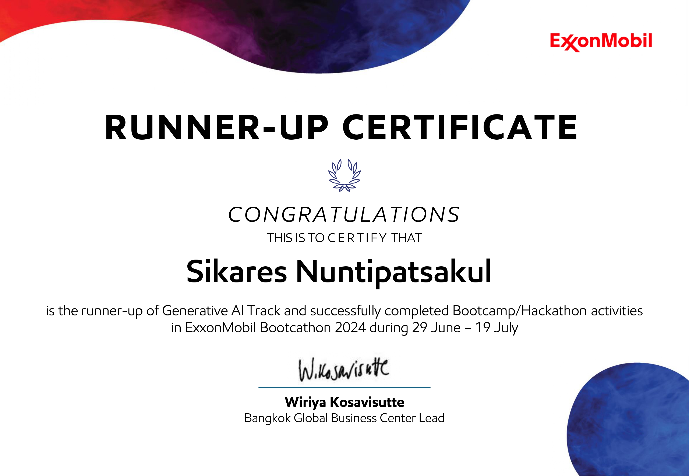

# 🏆ExxonMobil Bootcathon 2024 (1st Runner-up for "Generative AI")

Create and implement a sophisticated chatbot for ExxonMobil that is capable of answering customer inquiries and providing support. The goal is to increase ExxonMobil's revenue in Thailand by promoting and selling lubricant products, even in areas without gas stations.


## 💻Demo

- Youtube: [Demo Video](https://youtu.be/HxGgvHc3r9Y?si=MfI0oBARUAeF70hB)

- Canva: [Design Presentation](https://www.canva.com/design/DAGJ52rZEYY/L8NCkjP9sCHD1Bv-MHaiYQ/edit?utm_content=DAGJ52rZEYY&utm_campaign=designshare&utm_medium=link2&utm_source=sharebutton)

- Pitch Deck Presentation: [Pitch Deck](https://www.canva.com/design/DAGK1riGZfc/l_aQi1OqX08wY-PCho4suw/edit?utm_content=DAGK1riGZfc&utm_campaign=designshare&utm_medium=link2&utm_source=sharebutton)


## 🚀Used By

This project is used by the following companies:

- ExxonMobil


## 🔑Environment Variables

To run this project, you will need to add the following environment variables to your .env file

`HF_TOKEN` = HuggingFace Access Token

`GROQ_API_KEY` = GROQ API Key


## ✨Features

Model (LLAMA3-70b)
- Multi-Agent Architecture (8 Agents)
- Online Web search
- Speech to Text (Input)
- Text to Speech (Output)
- Car Series Recognition + Prompt to ask the best lubricant for the car at the same time
- Inputting a location to find nearby service centers.
- Searching for service centers.

## 🏅 Certificate




## 📥Run Locally

Clone the project

```bash
  git clone https://github.com/nutkung1/ExxonMobil-Bootcathon2024.git
```

Go to the project directory

```bash
  cd ExxonMobil-Bootcathon2024
```

Install dependencies

```bash
  pip install -r requirements.txt
```

Start the server

```bash
  streamlit run app.py
```


## 🛠️Tech Stack

**Client:** Streamlit

**Tools:** Langchain, OpenAI-Whisper, LLAMA3-70b, GROQ, CarNET


## 💬Feedback

If you have any feedback, please reach out to us at sikares.n@gmail.com